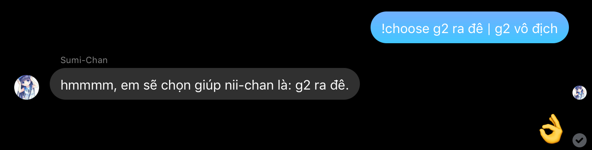

# Sumi-chan-bot

**Bot Sumi-chan Version 2.0.2**

Để lấy toàn bộ lệnh của bot bạn có thể sử dụng lệnh !help hoặc đọc ở bên dưới cái readme này!

Để có thể sử dụng bot, bạn phải cài nodejs và npm, và một tài khoản facebook có bật 2 lớp bảo mật theo nhận mã. Sau đây là hướng dẫn:

•Step 1: bạn phải clone hoặc download Sumi-chan này về, nếu máy bạn có git hãy sử dụng lệnh:
```
git clone https://github.com/roxtigger2003/Sumi-chan-bot
```
hoặc ở trên góc phải có nút xanh ghi là clone or download bạn nhấn vào chọn download zip là nó tự download file zip về và unzip ra nha :3

•Step 2: hãy trỏ cmd hoặc terminal về thư mục bot bằng lệnh: 
```
cd <thư mục chứa bot>
```
hoặc nếu bạn sài win 7 trở lên thì bạn có thể gọi cmd ngay trên thanh địa chỉ với:
```
cmd
```

•Step 3: sau khi bạn trỏ cmd hoặc terminal về thư mục bot bạn hãy gõ vào cmd hoặc terminal:
```
npm install
```
Và đợi cho nó chạy!

•Step 4: trong lúc nó đang cài đặt modules cho bot, bạn có thể chỉnh sửa và thiết lập cho bot trong:
```
login.js và config/index.js ngay phần login bạn phải chỉnh sửa email và password trong const obj để lấy appstate cho bot!
```

•Step 5: sau khi bạn chỉnh sửa, thiếp lập cho bot thì cũng là lúc các modules cài đặt thành công bạn hãy gõ vào cmd hoặc terminal:
```
node login.js và sau đó nhập mã xác thực 2 lớp
```

•Step 6: sau khi node login.js và nhập mã thành công, cmd hoặc terminal sẽ xuất ra 1 dòng rất dài báo hiệu là appstate đã ghi thành công thì bạn đã có thể khởi động bot bằng cách gõ: 
```
node index.js
```
Đến đây bot đã hoạt động rồi đấy :3

*đây là phần giải đáp thắc mắc:*

 - về phần yêu cầu:
  + Để có thể sử dụng, bạn phải có 1 tài khoản facebook đã hoạt động trên 3 tháng, đã xác thực số điện thoại và bật mã xác thực 2 lớp để tránh facebook quét và đánh dấu tài khoản spam đồng thời tránh bot chết giữa chừng cũng như giúp tài khoản bot của bạn bảo mật tốt hơn 
 - về phần login.js:
  + bạn phải nhập đúng mail và mật khẩu của tài khoản vào ngay const obj
  + nếu login.js trả về:
   • login-approval : thì là do bạn chưa bật xác minh 2 lớp hoặc chưa nhập code bảo mật
   • Wrong username/password. : thì là do bạn nhập sai tài khoản hoặc mật khẩu
   • unknow local bla bla gì đó : bạn phải vào tài khoản vào phần thông báo nó có phần xác minh vị trí
 - về phần index.js:
  + nó thường trả về lỗi database thì bạn cứ kệ nó
  + nếu nó trả về undefinded thì bạn hãy khởi động lại bot, lý do lỗi này là bạn đã vào tài khoản bot và chat với 1 số người

*Dưới đây là toàn bộ lệnh có thể sử dụng với bot: bạn hãy thay ${prefix} thành prefix bạn đã chỉnh sửa trong config/index.js*

\\\\\ Lệnh dành cho dân thường \\\\\ 
  
  prefix : Kiểm tra prefix (default là !)

  em ơi || @Kẹo Sữa : Ping bot

  ${prefix}lenny : ( ͡° ͜ʖ ͡°)
 
  ${prefix}hug : (つ ͡° ͜ʖ ͡°)つ
 
  ${prefix}mlem : ( ͡°👅 ͡°)

  ${prefix}say <text> : bot xuất ra âm thanh

  ${prefix}play <đường dẫn> : phát video, Lưu ý link phải thuộc dạng: https://youtube.com/ 

  ${prefix}choose <input 1> | <input 2> : chọn ngẫu nhiên trong tất cả, có thể làm dài ra ví dụ như <input1> | <input2> | <input3> | <input n+1> 

  ${prefix}echo <text> : bot sẽ nói lại y chang bạn vừa nói
 
  ${prefix}corona : kiểm tra tình hình dịch covid-19 (realtime)

  ${prefix}weather <city> : kiểm tra thời tiết, lưu ý phần city phải để là tên thành phố không dấu, không viết hoa!
 
  ${prefix}waifu : thử vận may có hốt được sumi-chan không (đa số là không "/)
 
  ${prefix}roll : lấy con số may mắn của bạn

  ${prefix}tát <@ người cần tát> : tát hoặc vả người mà bạn nhắc
 
  ${prefix}osuinfo -u <username> : lấy thông tin từ username osu! của bạn

  ${prefix}music <url youtube> : phát nhạc ở chat, lưu ý sử dụng link của https://youtube.com/, tất cả link khác đều không hoạt động

  ${prefix}rank : kiểm tra level của bạn, hoạt động ở multi group!

  \\\\\ Lệnh không phù hợp cho nơi làm việc(NSFW) \\\\\ 

  ${prefix}nhentai -r : lấy con số sauce may mắn của bạn
 
  ${prefix}nhentai -i <id> : lấy toàn bộ thông tin truyện của bạn

  ${prefix}jav : lấy code may mắn của bạn
 
  \\\\\ Admin Commands: call admin at https://fb.me/Cataliz2k \\\\\\ 

  ${prefix}ban <@ người bạn muốn ban> : khiến cho người dùng đấy không thể sử dụng bot
 
  ${prefix}unban <@ người bạn muốn unban> : khiến cho người dùng có thể sử dụng bot
 
  ${prefix}ban thread : khiến cho chat đó không thể sử dụng bot (áp dụng cho toàn bộ thành viên)
 
  ${prefix}unban thread : khiến cho chat đó có thể sử dụng bot (áp dụng dho toàn bộ thành viên kể cả người bị ban)
 
  ${prefix}adduser <id> : thêm thành viên vào nhóm
 
  ${prefix}kick <@ người bạn muốn kick> : xoá thành viên ra khỏi nhóm
 
  \\\\\ các lệnh ngoài lề phục vụ cho AI bot \\\\\\ 

  sumi ngu, buồi, vv : bot sẽ dizz bạn không thương tiếc

  sumi khôn : bot sẽ cám ơn bạn thay lời cám ơn của mình :3
 
  chửi thề : sẽ bị bot nhắc chỉnh sửa lại cái nết của bạn "/

**Credits**
- Contact me at: https://fb.me/Cataliz2k

Cám ơn vì đã tin tưởng bot của tớ <3 | nếu có lỗi gì xin vui lòng báo cáo ở link contact trên của mình nha <3
 
**Previews**



**Demo**

[Kẹo Sữa (Sumi-Chan)](https://facebook.com/Catalizcs.SumiChan)
