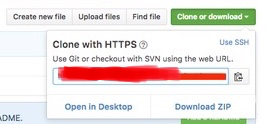
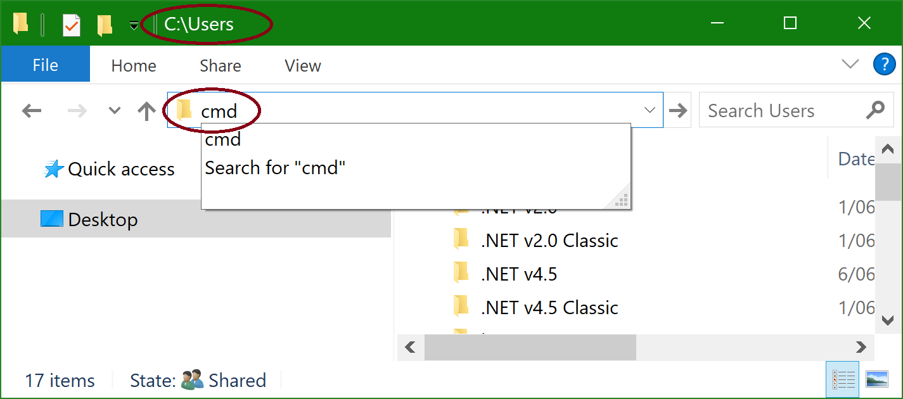
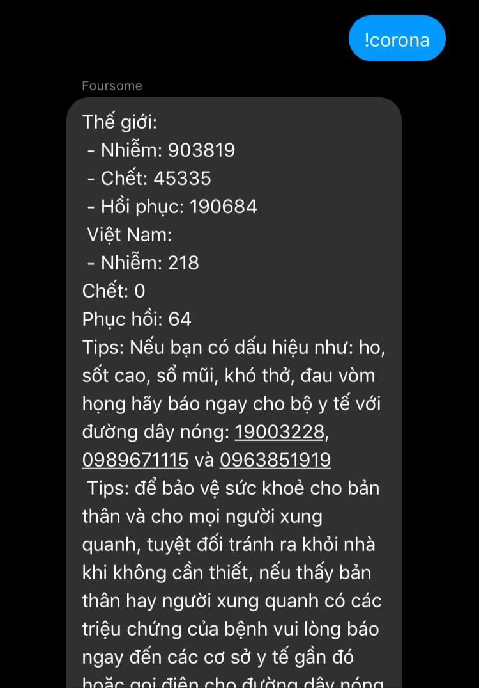

# Sumi-chan-bot (Thuộc project Sumi-Chan-Bot)

**Bot Sumi-chan Version 3.0.0 (Hoạt động tốt hơn trên glitch)**

Yêu cầu để có thể sử dụng bot:

 - [npm và nodejs phiên bản mới nhất](https://nodejs.org/en/) và [git(không bắt buộc)](https://git-scm.com/downloads)
 
 - Trình độ sử dụng nodejs ở mức trung bình
 
 - Một tài khoản facebook

# Hướng dẫn cài đặt

•Step 1: bạn phải clone hoặc download Sumi-chan này về, nếu máy bạn có git hãy sử dụng lệnh:
```
git clone https://github.com/roxtigger2003/Sumi-chan-bot
```
hoặc ở trên góc phải có nút xanh ghi là clone or download bạn nhấn vào chọn download zip là nó tự download file zip về và unzip ra nha :3


•Step 2: hãy trỏ cmd hoặc terminal về thư mục bot bằng lệnh: 
```
cd <thư mục chứa bot>
```
hoặc nếu bạn sài win 7 trở lên thì bạn có thể gọi cmd ngay trên thanh địa chỉ với:
```
cmd
```


•Step 3: sau khi bạn trỏ cmd hoặc terminal về thư mục bot bạn hãy gõ vào cmd hoặc terminal:
```
npm install
```
Và đợi cho nó chạy!

•Step 4: trong lúc nó đang cài đặt modules cho bot, bạn có thể chỉnh sửa và thiết lập cho bot trong:
```
login.js và config/index.js ngay phần login bạn phải chỉnh sửa email và password trong const obj để lấy appstate cho bot, và chỉnh sửa thông tin trong phần config/index.js
```

•Step 5: sau khi bạn chỉnh sửa, thiếp lập cho bot thì cũng là lúc các modules cài đặt thành công bạn hãy gõ vào cmd hoặc terminal:
```
node login.js và sau đó nhập mã xác thực 2 lớp
```

•Step 6: sau khi node login.js và nhập mã thành công, cmd hoặc terminal sẽ xuất ra 1 dòng rất dài báo hiệu là appstate đã ghi thành công thì bạn đã có thể khởi động bot bằng cách gõ: 
```
npm start
```
Đến đây bot đã hoạt động rồi đấy :3

**Credits**

- Contact Catalizcs at: [CatalizCS](https://fb.me/Cataliz2k)

- Contact SpermLord at: [SpermLord](https://www.facebook.com/LiterallyASperm)

nếu có lỗi hoặc yêu cầu sự trợ giúp bạn có thể contact bọn mình ở link phía trên hoặc ngay phần issues github này!
 
**Previews**




**Demo**

 tài khoản bot: [Kẹo Sữa (Sumi-Chan)](https://facebook.com/Catalizcs.SumiChan)